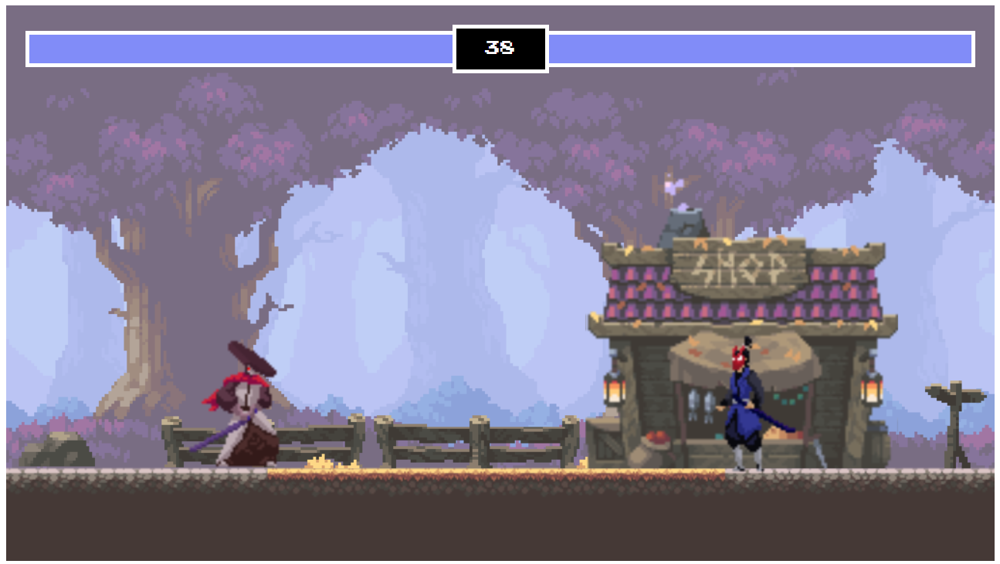

# XO-Fight



## Introduction
- Built and Deployed a two player fighting game. 
- With Animations, 
- Animation for Players,
- Animation for Hit,
- Background Animations,
- Real life Physics, 
- Hit, Death and Damage options, 

Features :
- Used canvas for the frame.
- Used running images for the animations.
- Different algorithms and arrangements for hit, damage, jump and death.
- Different damage rates for both the players.

Setup: run ```npm i && npm start``` to start the development server
#
